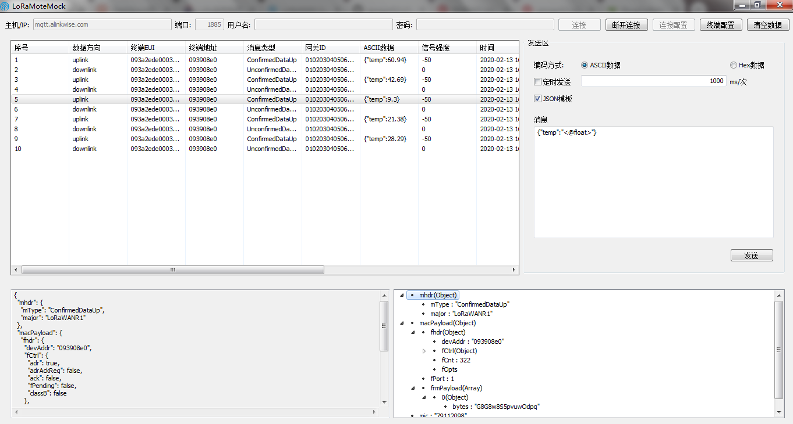
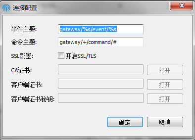
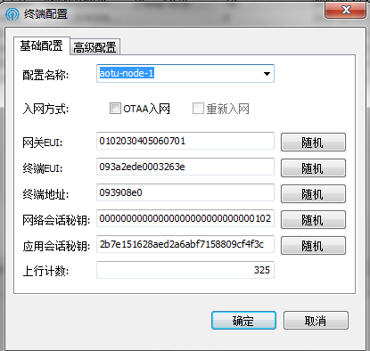
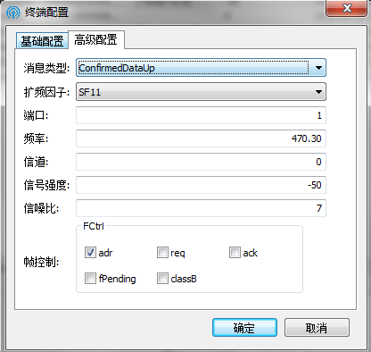

# LoRaMoteMock (LoRaWAN mote emulator 终端模拟器)
## 界面预览

## 连接配置
只支持MQTT连接

- 事件主题和命令主题分别为模拟器发布主题和订阅主题，loraserver默认模板格式，不推荐修改，如需修改需连同loraserver配置文件一起修改。
- SSL配置，根据MQTT Broker是否开启SSL来选择，若SSL认证开启客户端认证需配置三项，否则只需配置CA证书。

## 终端配置
### 基础配置

- 配置名称是一个终端一套配置，如果同名则覆盖，否则新建。
- 支持OTAA入网和ABP入网，默认ABP入网。
- 网关EUI为可以随便填16个hex字符，但如果想要在loraserver上查看网关实时数据，需要填写对应网关EUI。
- 其他配置参数根据LoRaWAN入网要求填写即可。

### 高级配置

- LoRa射频参数配置，可以默认不用修改，该参数只是模拟作用。

## JSON模板
- JSON模板引擎使用randomjson，语法请[请参考](https://github.com/zhoushengmufc/randomjson)，可以随机json数据。
- 也可以自行用mockjs,语法更加强大，当然也可自行用golang实现一个正则替换语法模板。

## 开发环境
- GoLand2019
- Go 1.12
- [loraserver地址](https://github.com/brocaar/chirpstack-network-server)

## 框架选择
- UI框架选择[Go walk](https://github.com/lxn/walk),该框架目前只支持windows环境,所以该工具目前只能在windows上运行。
- MQTT连接选择[paho.mqtt.golang](https://github.com/eclipse/paho.mqtt.golang)。
- Javascript解释器选择[otto](https://github.com/robertkrimen/otto)。

